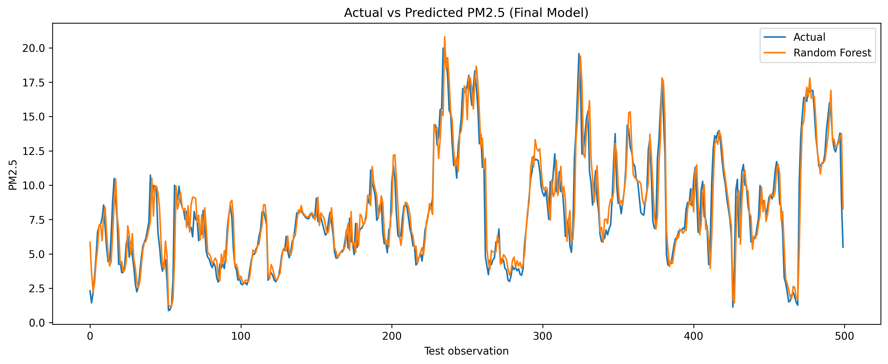
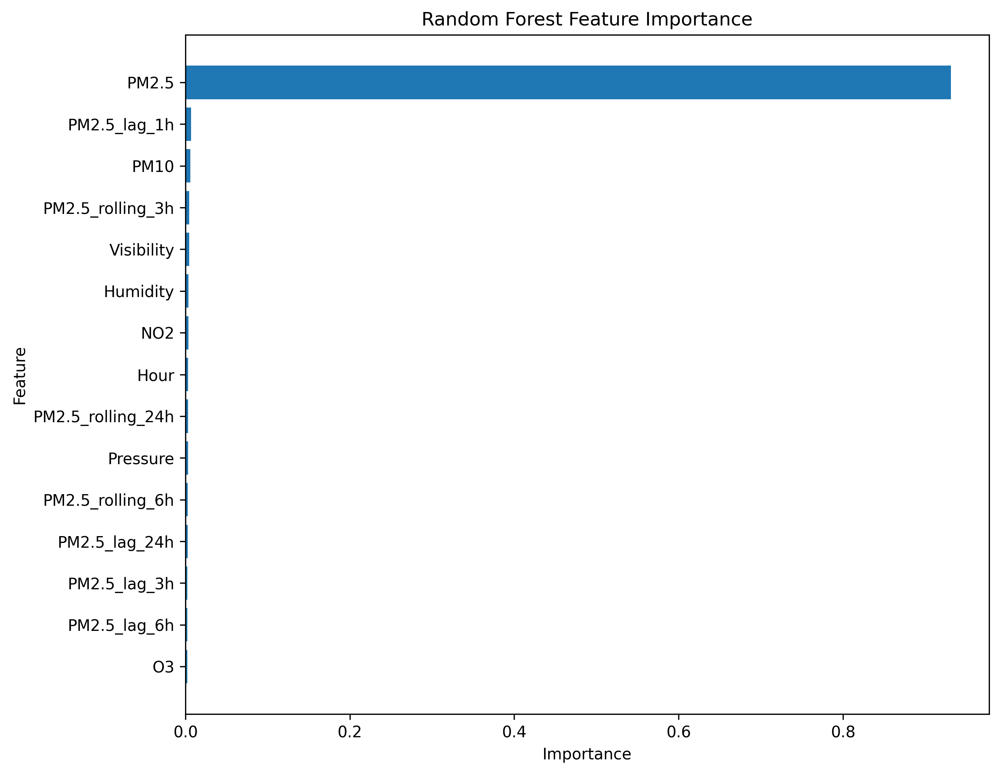
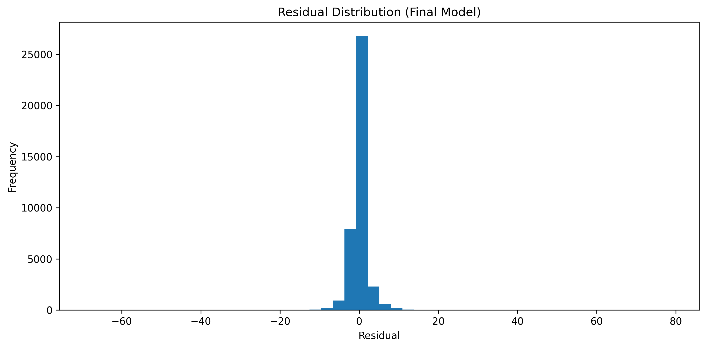
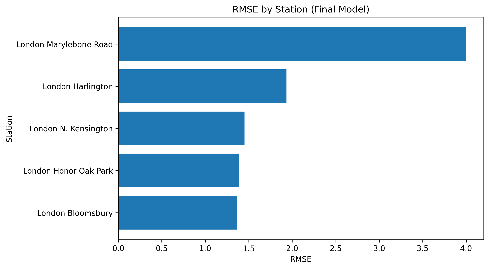

# London Air Quality Intelligence One-Hour PM2.5 Forecasting

<div align="center">

[](https://github.com/Nelvinebi/UK_Air_Quality_Intelligence_-_Forecasting_System/actions/workflows/ci.yml)
[](https://github.com/Nelvinebi/UK_Air_Quality_Intelligence_-_Forecasting_System/actions/workflows/docker.yml)


> A **Random Forest forecasting pipeline** that predicts PM2.5 concentration **one hour ahead** across five London air-quality monitoring stations, built on four years (2021–2024) of real DEFRA AURN pollution readings merged with Met Office MIDAS weather observations achieving **MAE 1.24 µg/m³** and **R² 0.86** on a full year of held-out test data, served through an interactive Streamlit dashboard.

</div>

<div align="center">

[](https://nelvinebi-ukairqualityintelligence-forecastingsystem.streamlit.app/)

</div>

---

## 📌 Problem

Fine particulate matter (PM2.5) is one of the most consistently harmful air pollutants to human health, and London despite being one of the most heavily monitored cities in the world still sees PM2.5 levels that spike sharply and unpredictably with traffic, weather, and seasonal patterns. Residents, commuters, and vulnerable groups (asthma sufferers, the elderly, outdoor workers) are typically only informed of poor air quality *after* it has already occurred, via retrospective DAQI readings.

A short-horizon forecast even just **one hour ahead** gives people a genuinely actionable window: postpone a run, close a window, choose a different commute. Building that forecast reliably requires correctly fusing multi-source, gap-riddled sensor data (AURN pollution readings and MIDAS weather observations don't share a clean, gapless timeline) and constructing a truly leak-free next-hour target a step that is easy to get subtly wrong (see [Methodology](#️-methodology--project-workflow)) and silently produces a broken model if done carelessly.

---

## 🎯 Objective

- Ingest and clean **real DEFRA UK-AIR AURN** pollutant data (NO2, PM10, PM2.5, O3) across 13 London monitoring stations, 2021–2024
- Ingest and clean **real Met Office MIDAS** hourly weather observations (Heathrow), 2021–2024
- Merge both sources on exact hourly timestamps into a single modeling dataset
- Engineer calendar, lag (1h/3h/6h/24h), rolling-average, and weather-interaction features
- Construct a **leak-free, exactly-aligned** next-hour PM2.5 target matched on `(Station, Datetime + 1h)`, not a naive row shift
- Train and compare a Linear Regression baseline against a Random Forest
- Tune hyperparameters and select the model that performs best on a genuinely held-out year (2024), not a random split
- Evaluate feature importance, residual behaviour, and per-station accuracy
- Ship a compressed, git-friendly model (~24 MB) behind an interactive **Streamlit dashboard**

---

## 🗂️ Dataset

All data is sourced from **real government/meteorological observations** no synthetic data is used in this project.

### Data Sources

| Dataset | Source | Resolution | Purpose |
|---------|--------|------------|---------|
| AURN pollution monitoring | DEFRA UK-AIR | Hourly | NO2, PM10, PM2.5, O3 concentrations across 13 London stations |
| MIDAS weather observations | Met Office, Heathrow station | Hourly | Temperature, dewpoint, humidity, wind speed/direction, pressure, visibility |

### Study Area & Period

| Parameter | Value |
|-----------|-------|
| City | London, United Kingdom |
| Stations used for modeling | 5 (of 13 available selected for data completeness) |
| Time Period | 1 Jan 2021 – 31 Dec 2024 (4 years) |
| Merged raw records | 168,015 (5 stations × ~33,603 hourly rows each) |
| Model-ready records (post feature engineering) | 147,228 |
| Train / test split | 2021–2023 train (108,102 rows) · 2024 held-out test (39,126 rows) |

### Monitoring Stations Used

| Station | Type | Hourly Records |
|---------|------|-----------------|
| London Bloomsbury | Urban background | 33,603 |
| London Harlington | Suburban background | 33,603 |
| London Honor Oak Park | Suburban background | 33,603 |
| London Marylebone Road | Roadside (traffic) | 33,603 |
| London N. Kensington | Urban background | 33,603 |

### Raw Data Completeness (before cleaning)

| Pollutant | % Missing |
|-----------|-----------|
| PM10 | 3.5% |
| PM2.5 | 8.2% |
| O3 | 21.0% |
| NO2 | 22.5% |

Negative pollutant readings (sensor artifacts physically impossible) are treated as missing rather than clipped to zero, to avoid biasing the distribution toward false zeros.

---

## 🛠️ Tools & Technologies

- **Language:** Python 3.9+
- **Data Processing:** Pandas, NumPy
- **Modeling:** scikit-learn `RandomForestRegressor`, `LinearRegression`, `SimpleImputer`, `RandomizedSearchCV`
- **Model Persistence:** joblib (compressed model artifacts)
- **Visualisation:** Matplotlib, Plotly (interactive dashboard charts)
- **Dashboard:** Streamlit custom-styled, single-page interactive app
- **Development:** Jupyter Notebook (exploratory pipeline), modular `src/` scripts (production pipeline)
- **Data Sources:** DEFRA UK-AIR AURN network, Met Office MIDAS (Heathrow)

---

## ⚙️ Methodology / Project Workflow

1. **AURN Ingestion & Reshaping:** Parse the wide, multi-station UK-AIR export (17 metadata rows skipped); reshape into a long `(Datetime, Station, pollutant...)` table across 13 stations
2. **AURN Cleaning:** Drop invalid timestamps and duplicates; treat negative pollutant readings as missing (not clipped to zero); restrict to 2021–2024; keep the 5 stations with the most complete records
3. **Weather Ingestion & Cleaning:** Parse MIDAS Heathrow hourly exports (283 metadata rows skipped); standardise column names; drop invalid timestamps/duplicates
4. **Merge:** Left-join pollution readings onto weather data on exact hourly timestamp no interpolation or resampling
5. **Calendar Features:** Year, month, day, hour, day-of-week, day-of-year, week-of-year, weekend flag
6. **Lag & Rolling Features:** PM2.5 lagged 1h/3h/6h/24h and rolling means over 3h/6h/24h computed via exact `(Station, Datetime offset)` matching, **not** `.shift()`, since the raw hourly series has gaps that would silently misalign a positional shift
7. **Weather Interaction Features:** Temperature × Humidity, WindSpeed², hour-over-hour pressure change
8. **Target Construction (the step that's easy to get wrong):** Next-hour PM2.5 matched on `(Station, Target_Datetime = Datetime + 1h)`. An earlier version of this pipeline used `df.shift(-1)`, which assumes row *N+1* is exactly one hour after row *N* — false whenever a station has a gap. The exact-match approach is independently re-validated after construction (0 alignment errors) before proceeding
9. **Train/Test Split:** Strictly time-based train on 2021–2023, test on all of 2024. No random shuffling, since this is a forecasting problem and the test period must be entirely after anything the model has seen
10. **Baseline Modeling:** Linear Regression and Random Forest, evaluated on the same held-out 2024 set
11. **Hyperparameter Tuning:** `RandomizedSearchCV` followed by a lightweight targeted grid; neither beat the untuned baseline's accuracy
12. **Model Selection:** Final Random Forest trained with `n_estimators=100, max_depth=15` depth capped after confirming it matches (in fact marginally improves) the unbounded-depth version while cutting the serialized model from ~206 MB to ~24 MB
13. **Evaluation:** Feature importance, residual distribution, largest individual errors, and per-station accuracy breakdown
14. **Deployment:** Model + fitted imputer + feature metadata persisted via `joblib`; served through a Streamlit dashboard that replays real held-out station-hours and supports bounded "what-if" adjustment of current-hour readings

---

## 📊 Key Features

- ✅ **Real DEFRA + Met Office data:** 4 years (2021–2024) of hourly AURN pollutant readings and MIDAS weather observations, no synthetic data
- ✅ **Leak-free target construction:** next-hour PM2.5 matched on exact `(Station, Datetime+1h)`, independently re-validated for alignment not a naive `shift(-1)`
- ✅ **29 engineered features:** raw pollutants, weather, calendar, PM2.5 lags/rolling windows, and two weather interaction terms
- ✅ **Strict time-based evaluation:** trained on 2021–2023, tested on a full held-out year (2024) never a random split, which would leak future information into training
- ✅ **Model comparison:** Linear Regression baseline vs. Random Forest, plus a documented hyperparameter search that honestly reports it *didn't* beat the baseline configuration
- ✅ **Depth-capped, git-friendly model:** `max_depth=15` matches full accuracy at ~24 MB instead of ~206 MB commits to a repo without git-lfs
- ✅ **Per-station error analysis:** quantifies that the roadside Marylebone Road station is meaningfully harder to forecast (RMSE 4.00) than the four background/suburban stations (RMSE 1.36–1.93)
- ✅ **Reproducible pipeline:** tested, importable `src/` modules now cover data processing, feature engineering, validation, training, inference, evaluation, and end-to-end orchestration (`data_processing.py`, `feature_engineering.py`, `validation.py`, `train.py`, `inference.py`, `evaluate.py`, `pipeline.py`)
- ✅ **Interactive Streamlit dashboard:** replays real 2024 station-hours with forecast vs. actual, a bounded what-if explorer, feature importance, and per-station accuracy styled around a London skyline theme

---

## 📸 Visualisations

### 🔹 Actual vs. Predicted PM2.5 — Final Model
> The final Random Forest closely tracks real PM2.5 dynamics across the held-out 2024 test set, including sharp pollution spikes



---

### 🔹 Feature Importance
> The current-hour PM2.5 reading itself dominates (93.1% importance) expected for a one-hour-ahead forecast, since PM2.5 is highly autocorrelated hour-to-hour; lag/rolling features and weather each contribute small but non-trivial signal



---

### 🔹 Residual Distribution
> Residuals are tightly centred near zero, confirming the model isn't systematically over- or under-predicting



---

### 🔹 RMSE by Station
> Marylebone Road (a roadside, traffic-facing station) is markedly harder to forecast than the four background/suburban stations its readings are noisier and more locally driven by traffic bursts than by the broader weather/pollution patterns the model learns



> 📌 *Additional exploratory figures (seasonal patterns, station comparisons, weather correlations) are saved in `outputs/figures/`.*

---

## 📈 Results & Insights

### Key Metrics Summary

| Model | MAE (µg/m³) | RMSE (µg/m³) | R² |
|-------|-------------|--------------|-----|
| Linear Regression | 1.333 | 2.435 | 0.835 |
| Random Forest (final, `max_depth=15`) | **1.241** | **2.243** | **0.860** |

### Accuracy by Station (2024 held-out test set)

| Station | MAE | RMSE | Observations |
|---------|-----|------|---------------|
| London Marylebone Road | 2.767 | **4.000** | 7,526 |
| London Harlington | 0.915 | 1.934 | 8,013 |
| London N. Kensington | 0.887 | 1.451 | 8,016 |
| London Honor Oak Park | 0.845 | 1.392 | 8,012 |
| London Bloomsbury | 0.863 | **1.363** | 7,559 |

### Top Feature Importances

| Feature | Importance |
|---------|-----------|
| PM2.5 (current hour) | 93.12% |
| PM2.5_lag_1h | 0.68% |
| PM10 | 0.58% |
| PM2.5_rolling_3h | 0.48% |
| Visibility | 0.45% |
| Humidity | 0.35% |

### Key Insights

- 🔍 **Autocorrelation dominates:** the current-hour PM2.5 reading alone carries ~93% of the model's predictive weight a one-hour-ahead forecast is, fundamentally, mostly persistence with a learned correction
- 🔍 **Roadside pollution is structurally harder to forecast:** Marylebone Road's RMSE (4.00) is more than double every background/suburban station's, consistent with traffic-driven bursts being less predictable from weather and recent history than ambient background pollution
- 🔍 **Tuning didn't beat the baseline:** `RandomizedSearchCV` and a follow-up targeted grid search both underperformed the untuned Random Forest configuration on the true held-out set a reminder that validation-set gains don't always generalise, and that reporting a negative tuning result honestly is more useful than quietly discarding it
- 🔍 **Depth capping is nearly free here:** limiting trees to `max_depth=15` slightly *improved* MAE (1.241 vs. 1.249 uncapped) while shrinking the serialized model by ~89% likely because unlimited depth was overfitting to noise the shallower trees don't chase
- 🔍 **Correct target alignment matters more than it looks:** an early version of this pipeline used `.shift(-1)` for the next-hour target, which silently mismatches whenever a station has a timestamp gap the fix (explicit datetime-based matching, independently re-validated) was a prerequisite for every result above being trustworthy

---

## 🚀 Live Dashboard

📊 **[View the Interactive Streamlit Dashboard →](https://nelvinebi-ukairqualityintelligence-forecastingsystem.streamlit.app/)**

The dashboard includes:
- **Live Station Snapshot:** browse real, held-out 2024 station-hours and see the model's forecast against what actually happened, with a UK DEFRA Daily Air Quality Index–style band
- **What-if Explorer:** nudge current-hour PM2.5, NO2, PM10, temperature, humidity, and wind speed for a selected snapshot, while recent history (lags/rolling averages) stays fixed at its real values keeping every adjustment physically sensible rather than a fabricated 29-feature guess
- **Feature Importance:** interactive chart of what actually drives the forecast
- **Accuracy by Station:** RMSE comparison across all five monitoring sites
- **About:** methodology summary and headline model metrics

---

## 📁 Repository Structure

```
📦 london-air-quality-intelligence/
│
├── 📂 data/
│   ├── raw/                                 # Original AURN + MIDAS downloads
│   └── processed/
│       ├── london_aurn_pm25.csv             # Cleaned AURN pollutant data
│       ├── heathrow_weather_2021_2024.csv   # Cleaned MIDAS weather data
│       ├── london_air_quality_weather_2021_2024.csv   # Merged dataset
│       └── london_air_quality_features_2021_2024.csv  # Model-ready features + target
│
├── 📂 notebooks/
│   ├── 01_data_collection_and_cleaning.ipynb
│   ├── 02_exploratory_data_analysis.ipynb
│   ├── 03_feature_engineering.ipynb
│   ├── 04_baseline_models.ipynb
│   └── 05_model_tuning.ipynb
│
├── 📂 src/
│   ├── data_processing.py                  # AURN + weather cleaning and merge pipeline
│   ├── feature_engineering.py              # Lag/rolling/calendar features + leak-free target
│   ├── validation.py                       # Dataset, schema, timestamp, and model-artifact preflight checks
│   ├── train.py                            # Trains and saves the final Random Forest + runtime metadata
│   ├── inference.py                        # Validates inputs and provides reusable prediction functions
│   ├── evaluate.py                         # Feature importance, residuals, station-level errors
│   └── pipeline.py                         # End-to-end orchestration with validation checkpoints and skip flags
│
├── 📂 models/
│   ├── random_forest_pm25.pkl              # Final trained model (~24 MB)
│   ├── imputer.pkl                          # Fitted median imputer
│   └── model_metadata.json                  # Feature list, target name, model params
│
├── 📂 outputs/
│   ├── figures/                             # All saved plots (EDA + baseline + final)
│   ├── reports/                             # final_predictions.csv, station_level_errors.csv, feature_importance.csv
│   └── baseline_model_results.csv           # Linear Regression vs. Random Forest comparison
│
├── 📂 app/
│   ├── streamlit_app.py                     # Interactive dashboard
│   └── assets/
│       └── london_skyline.jpg
│
├── 📂 .github/
│    └── workflows/
│       ├── ci.yml                           # Runs the automated pytest suite on pushes and pull requests
│       └── docker.yml                       # Builds the container, starts it, and verifies Streamlit health
│
├── 📂 tests/
│   ├── test_feature_engineering.py         # Validates temporal features, leakage prevention, targets, and splitting
│   ├── test_inference.py                   # Tests validated feature preparation and prediction behavior
│   ├── test_model_artifacts.py             # Verifies model, imputer, metadata, and feature compatibility
│   ├── test_pipeline.py                    # Tests stage ordering, skip logic, validation gates, and failure handling
│   ├── test_training_metadata.py           # Ensures retraining preserves runtime environment metadata
│   └── test_validation.py                  # Tests dataset integrity and model-artifact preflight validation
│
├── Dockerfile                             # Defines the self-contained Python/Streamlit production image
├── .dockerignore                          # Excludes development-only files from the Docker build context
├── .env.example                           # Documents optional runtime environment variables
├── pytest.ini                             # Configures pytest discovery and test execution
├── requirements.txt                       # Runtime Python dependencies
├── requirements-dev.txt                   # Testing, notebook, coverage, and linting dependencies
├── README.md                              # Project overview, methodology, results, and reproduction instructions
└── LICENSE                                # Repository licensing terms
```

---

## ▶️ How to Run

### Prerequisites

- Python 3.13 recommended
- Git
- Docker (optional, for isolated container execution)

The committed model artifacts were validated with:

- Python 3.13
- scikit-learn 1.8.0
- joblib 1.5.3

### Local Installation

Clone the repository:

```bash
git clone https://github.com/Nelvinebi/UK_Air_Quality_Intelligence_-_Forecasting_System.git
cd UK_Air_Quality_Intelligence_-_Forecasting_System
```

Create and activate a virtual environment:

```bash
python -m venv .venv
```

Windows:

```bash
.venv\Scripts\activate
```

Linux/macOS:

```bash
source .venv/bin/activate
```

Install runtime dependencies:

```bash
python -m pip install --upgrade pip
python -m pip install -r requirements.txt
```

### Runtime Configuration

The application supports an optional `LOG_LEVEL` environment variable. The default is `INFO`, as documented in `.env.example`.

The application reads this value directly from the process environment; it does not automatically load `.env` files.

PowerShell:

```powershell
$env:LOG_LEVEL = "INFO"
```

macOS/Linux:

```bash
export LOG_LEVEL=INFO
```

Common logging levels include `DEBUG`, `INFO`, `WARNING`, `ERROR`, and `CRITICAL`.

If `LOG_LEVEL` is not set, the application uses `INFO`.

Launch the Streamlit application:

```bash
streamlit run app/streamlit_app.py
```

The application will normally be available at:

```text
http://localhost:8501
```

### Run the Test Suite

Install the development dependencies:

```bash
python -m pip install -r requirements-dev.txt
```

Run all automated tests:

```bash
python -m pytest -q
```

Current test suite:

```text
50 passed
```

The tests validate:

- time-aware feature engineering
- station-boundary isolation
- exact lag construction
- rolling-window leakage prevention
- one-hour target alignment
- time-based train/test splitting
- model artifact availability
- model/metadata feature compatibility
- imputer compatibility
- saved-model inference
- inference feature validation
- prediction shape and numerical validity

Tests also run automatically through GitHub Actions on pushes and pull requests to `main`.

### Run the Full ML Pipeline

The complete project workflow can now be executed with a single command:

```bash
python -m src.pipeline
```

The default pipeline runs these stages in order:

```text
Data processing
    ↓
Validate processed data
    ↓
Feature engineering
    ↓
Validate engineered data
    ↓
Model training
    ↓
Validate model artifacts
    ↓
Model evaluation
```

The validation checkpoints fail fast if the processed dataset, engineered features, or persisted model bundle do not satisfy the expected project contract.

Individual stages can be skipped when validated artifacts already exist:

```bash
python -m src.pipeline --skip-data-processing
python -m src.pipeline --skip-feature-engineering
python -m src.pipeline --skip-training
python -m src.pipeline --skip-evaluation
```

When an upstream stage is skipped but a downstream stage still depends on its artifacts, the existing artifacts are validated before execution continues.

### Docker

The project includes a self-contained Docker runtime.

Build the image:

```bash
docker build -t uk-air-quality .
```

Run the application:

```bash
docker run --rm -p 8501:8501 uk-air-quality
```

Then open:

```text
http://localhost:8501
```

The Docker image includes the application code, production source modules, trained model artifacts, processed data required by the dashboard, and runtime dependencies.

The container exposes a Streamlit health endpoint at:

```text
http://localhost:8501/_stcore/health
```

A dedicated GitHub Actions workflow automatically builds the Docker image, starts the container, and verifies that this health endpoint responds successfully.

### Reproducibility & CI

Two automated GitHub Actions workflows protect the repository at HEAD:

1. **CI** — creates a fresh Python 3.13 environment, installs dependencies, and executes the complete pytest suite.
2. **Docker Build** — builds the Docker image, starts an isolated container, and verifies application health.

This means changes pushed to `main` are independently checked outside the developer's local environment.

### Dependencies

Runtime dependencies are declared in `requirements.txt`.

Development and validation dependencies are declared separately in `requirements-dev.txt`.

Key runtime packages include:

- pandas
- NumPy
- scikit-learn
- joblib
- Matplotlib
- Plotly
- Streamlit
```

---

## ⚠️ Limitations & Future Work

**Current Limitations:**
- Only **5 of 13** available London AURN stations were used the excluded stations had substantially incomplete records, so spatial coverage is limited to the areas these five represent
- **Single weather source (Heathrow)** is applied uniformly across all five monitoring stations, despite them being geographically spread across London introduces potential mismatch for stations further from Heathrow
- The model uses the **current hour's actual** weather and pollutant readings as inputs; a genuine live production forecast would need next-hour *forecast* weather, not just the latest observation, since real-time weather for "one hour from now" isn't yet known
- **Roadside pollution (Marylebone Road)** is forecast meaningfully less accurately than background stations the model has no explicit traffic-volume signal to explain those bursts
- Feature importance is dominated by autocorrelation (current PM2.5); this is an accurate one-hour forecast but says less about the *causal* drivers of pollution than a longer-horizon model would

**Future Improvements:**
- 🌍 Incorporate weather data local to each individual station rather than a single Heathrow source
- ⏱️ Extend the forecast horizon beyond one hour (3h, 6h, 24h) to support genuinely actionable planning
- 🚗 Add traffic-volume or congestion data to improve roadside station accuracy
- 🌦️ Integrate a live weather forecast API for true production-ready one-hour-ahead prediction (rather than backtesting on known past weather)
- 🌳 Compare against gradient boosting methods (XGBoost, LightGBM) and a simple LSTM/temporal baseline
- 📍 Extend coverage to the remaining AURN stations with targeted missing-data imputation strategies
- 🗺️ Add spatial interpolation between stations for a continuous London-wide PM2.5 surface

---
<div align="center">

## 👤 Author

**Name:** Agbozu Ebingiye Nelvin

🌍 Environmental Data Scientist | GIS & Remote Sensing | Big Data Engineering | Climate Analytics
📍 Port Harcourt, Rivers State, Nigeria

[](https://www.linkedin.com/in/agbozu-ebi/)
[](https://github.com/Nelvinebi)
[](mailto:nelvinebingiye@gmail.com)
[](https://share.streamlit.io/user/nelvinebi)

</div>

---

## 📄 License

This project is licensed under the **MIT License** free to use, adapt, and build upon for research, education, and environmental analytics.
See the [LICENSE](LICENSE) file for full details.

---

## 🙌 Acknowledgements

- **DEFRA UK-AIR** for providing open access to the AURN air quality monitoring network
- **Met Office** for MIDAS open weather station data (Heathrow)
- **scikit-learn** community for the modeling tools powering this pipeline
- **Streamlit** for enabling rapid interactive dashboard development and free cloud deployment

---

<div align="center">

⭐ **If this project helped you, please consider starring the repo!**

*Part of a broader portfolio of Environmental Data Science and Big Data Engineering projects.*

🔗 [View All Projects](https://github.com/Nelvinebi?tab=repositories) · [Connect on LinkedIn](https://www.linkedin.com/in/agbozu-ebi/)

</div>
